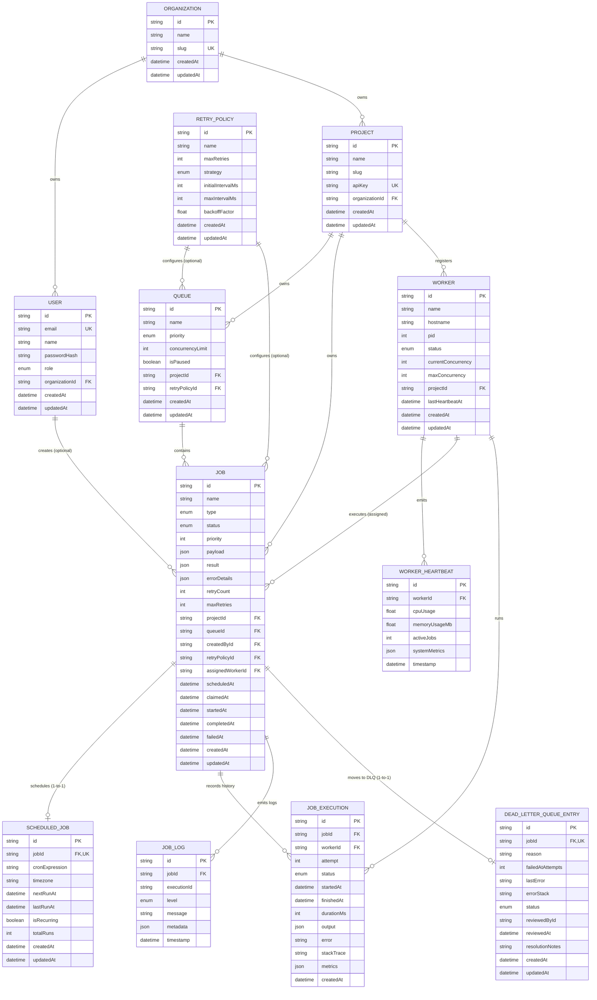

# Entity-Relationship (ER) Diagram

The following Mermaid ER diagram documents the normalized PostgreSQL database schema designed in Prisma for the **Distributed Job Scheduler** platform.

---

## Entity Descriptions

| Entity | Primary Key | Key Foreign Keys & Indexes | Role in Platform |
| :--- | :--- | :--- | :--- |
| **Organization** | `id` (UUID) | `slug` (Unique) | Top-level tenant boundary |
| **User** | `id` (UUID) | `organizationId`, `email` (Unique) | User identity & authentication |
| **Project** | `id` (UUID) | `organizationId`, `(organizationId, slug)` (Unique) | Project workspace owning queues and jobs |
| **RetryPolicy** | `id` (UUID) | Configures fixed, linear, or exponential retry backoff | Reusable retry policy template |
| **Queue** | `id` (UUID) | `projectId`, `(projectId, name)` (Unique) | Queue container supporting priority and concurrency limits |
| **Job** | `id` (UUID) | `projectId`, `queueId`, `assignedWorkerId`, `status` | Core background job model |
| **ScheduledJob** | `id` (UUID) | `jobId` (1-to-1 Unique), `nextRunAt` (Indexed) | Extensions for delayed and cron recurring jobs |
| **Worker** | `id` (UUID) | `projectId`, `status`, `lastHeartbeatAt` (Indexed) | Active worker process node tracking concurrency |
| **WorkerHeartbeat**| `id` (UUID) | `workerId`, `timestamp` (Indexed) | High-frequency telemetry pulse logs |
| **JobExecution** | `id` (UUID) | `jobId`, `workerId`, `(jobId, attempt)` (Indexed) | Historical log of every execution attempt |
| **JobLog** | `id` (UUID) | `jobId`, `timestamp` (Indexed) | Application execution stdout/stderr logs |
| **DeadLetterQueueEntry**| `id` (UUID) | `jobId` (1-to-1 Unique), `status` (Indexed) | Terminal failure records requiring human review/retry |
